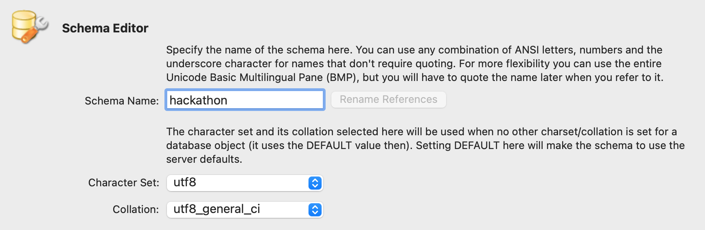
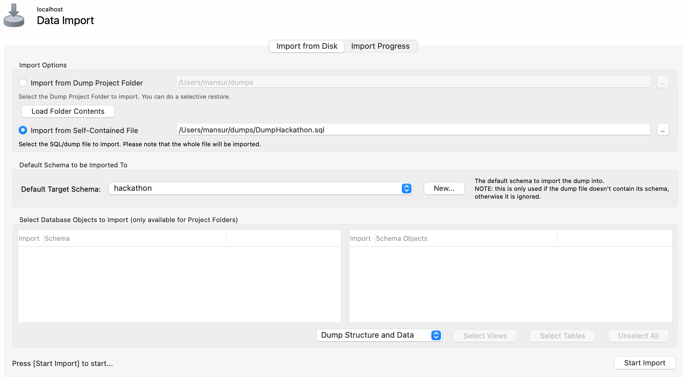
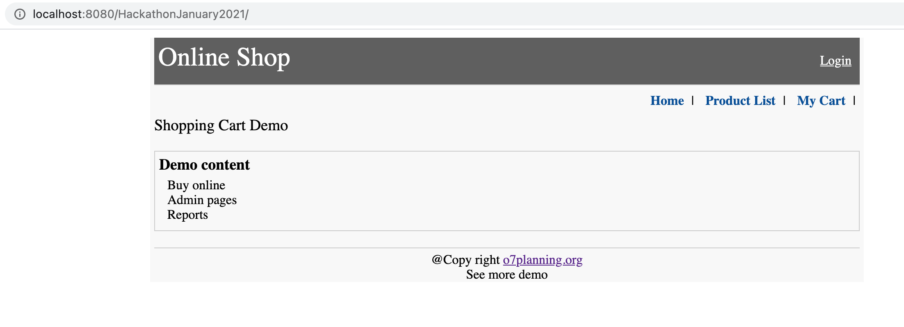
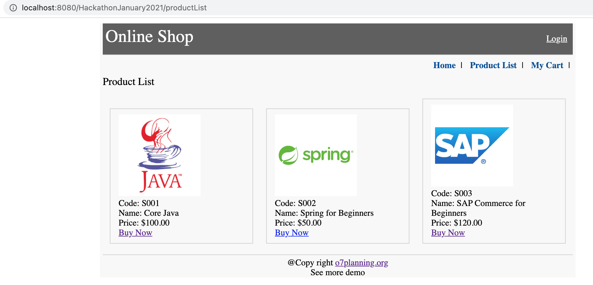

## itelligence Hackathon January 2021

---
## IMPORTANT NOTICE
In the hackathon you will be asked to add features to this inital sample project. It is good to make practices on how to add new features to the project.

This project is based on the example provided by o7planning website.

---

### Prerequisites

- An IDE you're comfortable with
- Java 8
- MySQL >= 5.7
- Apache Maven

This example project is ready to install and run. You should be able to run the project without performing steps in the tutorial.

## Installation Steps
- Create a new schema named `hackathon` in MySQL
  
  
- Import `DumpHackathon.sql` to `hackathon`
  
  
- Update username and password information for database in `ds-hibernate-cfg.properties` file
- Run `mvn clean install` on root directory of the project
- Run `mvn tomcat7:run` 
- After startup navigate http://localhost:8080/HackathonJanuary2021/ you should see something similar to the following
  

- For product list (http://localhost:8080/HackathonJanuary2021/productList) you should see the following
  
  
Username and password information for manager and employee role is as follows

| Username  | Password | Role |
| ------------- | ------------- | ------------- |
| manager  | 123  | ROLE_MANAGER |
| employee  | 123  | ROLE_EMPLOYEE |

### Reference
https://o7planning.org/10605/create-a-java-shopping-cart-web-application-using-spring-mvc-and-hibernate
